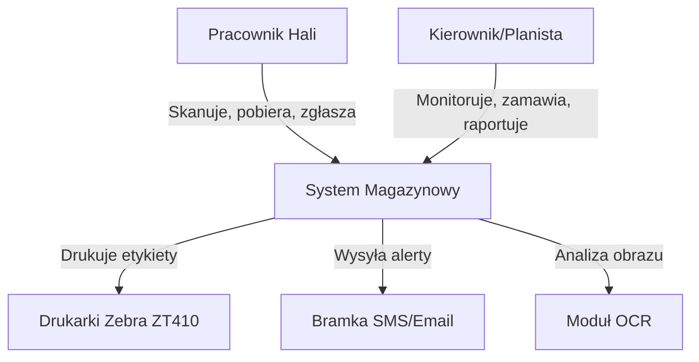

# Architektura Systemu Magazynowo-Produkcyjnego (Model C4)

## 1. Context Diagram (Level 1)

System zarządza przepływem materiałów (profili PVC) w fabryce okien, integrując pracowników hali, zarządzanie oraz urządzenia peryferyjne.



## 2. Container Diagram (Level 2)

Podział na główne kontenery aplikacyjne i bazy danych.

```mermaid
graph TD
    subgraph Clients
        MobileApp[Android App (Kotlin)] -->|REST API / Sync| Backend
        WebApp[Web App (React)] -->|REST API| Backend
    end

    subgraph "Core System"
        Backend[Backend API (Spring Boot)]
        DB[(PostgreSQL)]
        Backend --> DB
    end

    subgraph "Edge / Hardware"
        OCRService[OCR Service (Python/CV)]
        PrintService[Print Server (Local Agent)]
    end
    
    subgraph "Analytics & AI"
        AIModule[AI Service (Python/FastAPI)] -->|Analyze & Predict| DB
    end

    MobileApp -->|Offline-first sync| DB
    MobileApp -->|Image Upload| Backend
    Backend -->|Process Image| OCRService
    Backend -->|ZPL Commands| PrintService
    Backend -->|Request Prediction| AIModule
    PrintService --> Printer[Zebra Printer]
```

### Decyzje Architektoniczne:
1.  **Offline-first (Android)**: Aplikacja mobilna posiada lokalną bazę danych (Room). Synchronizacja następuje w tle, gdy dostępna jest sieć. Kluczowe dla stabilności na hali.
2.  **Modułowość**: Backend podzielony na moduły (Inventory, Production, Reporting), co pozwala na niezależny rozwój.
3.  **OCR jako usługa**: Wyodrębnienie OCR pozwala na łatwą wymianę modelu/algorytmu bez wpływu na core logikę.
4.  **AI jako mikroserwis**: Oddzielenie logiki ML (Python) od core biznesowego (Java/Kotlin) ułatwia wdrażanie bibliotek Data Science.
5.  **Drukarki**: Użycie lokalnego agenta lub bezpośredniej komunikacji sieciowej (zależnie od infrastruktury sieciowej hali) do obsługi ZPL.

## 3. Component Diagram - Backend (Level 3)

Główne komponenty wewnątrz aplikacji Spring Boot.

*   **Inventory Controller**: Obsługa REST API dla stanów magazynowych.
*   **Sync Service**: Obsługa synchronizacji danych z urządzeniami mobilnymi (rozwiązywanie konfliktów).
*   **Production Service**: Logika biznesowa zużycia materiału (reguły odpadów vs nadwyżek).
*   **Alerting Service**: Monitorowanie stanów minimalnych i wysyłka powiadomień.
*   **Label Generator**: Generowanie komend ZPL.

## 4. Kluczowe Przepływy Danych

### A. Pobranie materiału (Offline)
1.  Pracownik skanuje/wybiera profil w aplikacji Android.
2.  App sprawdza stan w lokalnym DB (Room).
3.  App rejestruje zdarzenie `MaterialTaken` lokalnie.
4.  App aktualizuje lokalny stan magazynowy (optymistycznie).
5.  Gdy sieć wraca -> Worker synchronizuje zdarzenie do Backendu.
6.  Backend waliduje, aktualizuje PostgreSQL i replikuje zmianę do innych urządzeń.

### B. Rozpoznawanie Naklejki (OCR)
1.  Android robi zdjęcie.
2.  Zdjęcie (lub wycinek) leci na endpoint `/api/ocr/recognize`.
3.  Backend przekazuje do OCR Service.
4.  OCR zwraca surowy tekst.
5.  Backend parsuje tekst (Regex/Heurystyka) na: Profil, Kolor, Długość.
6.  Backend zwraca sformatowane dane do Androida do potwierdzenia przez pracownika.

## Ryzyka
1.  **Konflikty danych**: Przy pracy offline dwóch pracowników może wziąć tę samą "ostatnią sztukę".
    *   *Mitygacja*: Logika "soft-lock" ważna przez krótki czas lub akceptacja ujemnego stanu i alert dla kierownika (w rzeczywistości fizycznej materiał zniknął, system musi to odzwierciedlić).
2.  **Jakość zdjęć OCR**: Słabe oświetlenie na hali.
    *   *Mitygacja*: Możliwość ręcznej edycji każdego pola po skanowaniu.
3.  **Awaria sieci**: Brak możliwości druku etykiet (jeśli drukarka sieciowa).
    *   *Mitygacja*: Buforowanie wydruków na tablecie i puszczenie ich po odzyskaniu połączenia lub Bluetooth bezpośrednio do drukarki.
